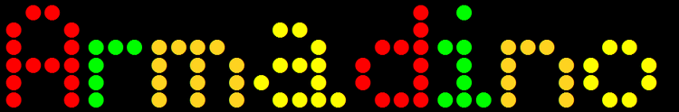
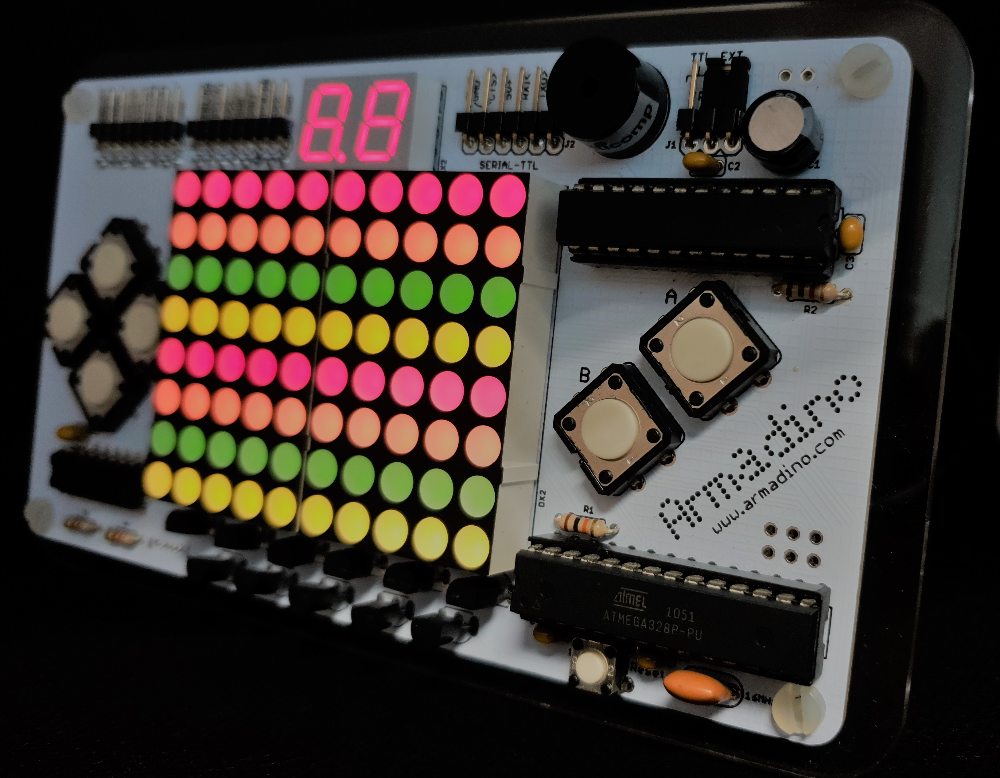

## Armadino - an Arduino Gameboy, Clock, Electronic Lab, TVout Console and more...

**Armadino** is meant to be much more than a Arduino-based handheld gamepad. By attaching appropriate accessories to the expansion pins, it may be turned into a LED clock, a TV game console, an Arduino experiment kit or just about any creative project to control or sense.

It is not over-the-top and despite its brutal simplicity, has a colour LED matrix, a score board and 6-button keypad that make it both fun and versatile. Don't just experiment and learn, make something useful with it and proudly display it.

**Armadino** is also suitable for STEM education - from junior introduction to digital making to a college or graduate course in programming, embedded systems and micro-controller.

The **Armadino** is programmable as an Arduino UNO, with library functions for LED matrix, 7-segment LED, buttons, sound and TVout, and example projects including a clock, handheld game (Snake, Pong, Space Invaders) and TVout games (Tetris, Breakout, Space Invaders again!)

For construction and software installation details, visit this [Instructables](https://www.instructables.com/Armadino-an-Arduino-Gameboy-Clock-Electronic-Lab-T/); and the many roles Armadino can do, [Instagram](https://www.instagram.com/armadino.clock/) for photos and short video clips of the clock, handheld and TVout games.

#### License

GNU General Public License v3.0. See [LICENSE](LICENSE)

#### Acknowledgments

* [Windell H. Oskay for code written for the MeggyJr; and Arthur J. Dahm III and Jay Clegg for code written for the Peggy 2.0](https://wiki.evilmadscientist.com/Meggy_Jr_RGB)
* [Ronald Willem Besinger's blog "AVR Twinkle Twinkle Using PWM Project"](http://www.ermicro.com/blog/?p=580)
* [Tom Igoe's tutorial on generating tone](https://itp.nyu.edu/physcomp/labs/labs-arduino-digital-and-analog/tone-output-using-an-arduino/)

